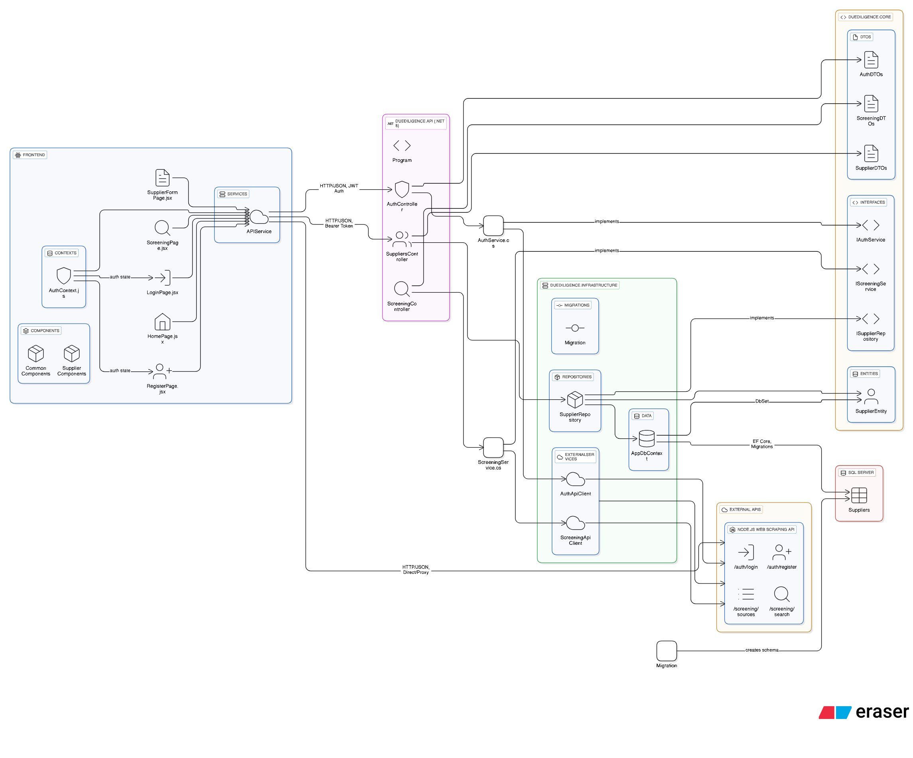
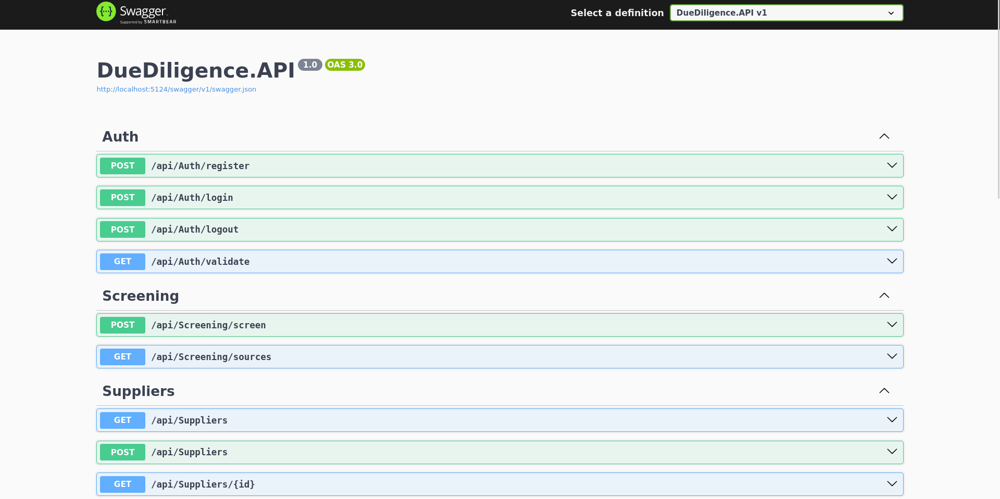

# Supplier Due Diligence Web Application

This repository contains a clean-architecture web application for supplier due diligence. It includes:

- A .NET 8 Web API (DueDiligence.API) implementing the backend and exposing REST endpoints for suppliers and screening workflows.
- A Core library (DueDiligence.Core) containing DTOs, entities and service/repository interfaces.
- An Infrastructure project (DueDiligence.Infrastructure) with EF Core, repository implementations and external service clients.
- A React frontend (frontend/) providing a simple UI for authentication, supplier CRUD and screening flows.

This README explains the architecture, key concepts, and how to run the project locally for development.

## Index

- [Architecture](#architecture)
- [Project Structure](#project-structure)
- [Features](#features)
- [Local setup & run](#local-setup--run)
  - [Database (SQL Server via Docker)](#2-database-sql-server-via-docker)
  - [Run Backend (API)](#4-run-the-backend-api)
  - [Run Frontend (React)](#5-run-the-frontend-react)
- [Troubleshooting](#troubleshooting)

## Architecture



The project follows a Clean Architecture pattern with clear separation of concerns:

- **DueDiligence.API** — Presentation layer (Controllers, middleware, configuration)
- **DueDiligence.Core** — Domain layer (Entities, DTOs, service interfaces)
- **DueDiligence.Infrastructure** — Data access and external services (EF Core, HTTP clients)
- **Frontend** — React SPA consuming the .NET API and external screening services

### Key Design Principles

- **Dependency Inversion**: Core defines interfaces, Infrastructure implements them
- **JWT Authentication**: Token-based auth with automatic token refresh
- **External API Integration**: Separation between local supplier data and external screening services
- **CORS Handling**: Development proxy configuration for seamless API integration

### Authentication Flow

1. User logs in via Frontend → Auth Controller
2. JWT token returned and stored in localStorage
3. Axios interceptors attach token to subsequent requests
4. JWT Middleware validates tokens on protected endpoints

### Data Flow

- **Suppliers**: Frontend ↔ .NET API ↔ Infrastructure ↔ SQL Server
- **Screening**: Frontend → External Node.js API (direct or via proxy)
- **Results**: Can be stored locally in SQL Server or consumed directly from external API

## Project Structure

```
├── DueDiligence.API/              # ASP.NET Web API (Controllers, Program.cs)
│   ├── Controllers/               # REST API endpoints
│   ├── Properties/               # Launch settings
│   └── appsettings*.json         # Configuration files
├── DueDiligence.Core/            # Domain layer (DTOs, Entities, Interfaces)
│   ├── DTOs/                     # Data Transfer Objects
│   ├── Entities/                 # Domain entities
│   └── Interfaces/               # Service and repository contracts
├── DueDiligence.Infrastructure/   # Data & External Services layer
│   ├── Data/                     # EF Core DbContext
│   ├── ExternalServices/         # HTTP clients for external APIs
│   ├── Migrations/               # EF Core migrations
│   ├── Repositories/             # Data access implementations
│   └── Services/                 # Service implementations
├── frontend/                     # React SPA
│   ├── public/                   # Static assets
│   ├── src/
│   │   ├── components/           # Reusable React components
│   │   ├── contexts/             # React contexts (auth, etc.)
│   │   ├── pages/                # Page components
│   │   └── services/             # API client services
│   └── package.json              # Frontend dependencies & scripts
└── README.md                     # This file
```

## Architecture

The project follows a light Clean Architecture split across three main projects:

- **DueDiligence.API** — Presentation layer (ASP.NET Web API). Contains controllers and wiring for services.
- **DueDiligence.Core** — Domain and contracts: DTOs, Entities and interfaces (IRepository, IAuthService, IScreeningService).
- **DueDiligence.Infrastructure** — Implementation details: EF Core DbContext, repositories, external HTTP clients and services.

This separation keeps business rules and data contracts in `Core`, while `Infrastructure` knows about persistence and remote APIs. The `API` layer composes services and exposes HTTP endpoints.

**Frontend:** a React single-page application under `frontend/` that consumes the .NET API for suppliers and a Node.js screening API (deployed externally).

## Features

- **Authentication:** JWT tokens are issued by the auth endpoint and stored in the browser (localStorage) by the frontend. Axios interceptors attach the token to requests.
- **Persistence:** EF Core is used in `Infrastructure` with a SQL Server database. Migrations are included under `DueDiligence.Infrastructure/Migrations`.
- **External screening:** The project integrates with an external screening service (a Node.js API). The frontend communicates directly with that service for screening operations; the backend may also call external services where applicable.
- **CORS:** When running the frontend and backend on different origins in development, CORS must be enabled in the API or a dev proxy used in the frontend.

## Prerequisites

- .NET 8 SDK
- Node.js (LTS) and npm
- Docker (to run a local SQL Server instance) — recommended for local DB
- Git

## Local setup & run

Below are steps that work on Linux/macOS/Windows (adjust commands for your shell if needed).

### 1) Clone the repo

```bash
git clone <your-repo-url>
cd Supplier-due-diligence-web-application
```

### 2) Database (SQL Server via Docker)

This project uses SQL Server for development. The simplest approach is to start a SQL Server container:

```bash
docker run -e "ACCEPT_EULA=Y" -e "SA_PASSWORD=Your_strong@Passw0rd" \
  -p 1433:1433 --name dds-sqlserver -d mcr.microsoft.com/mssql/server:2022-latest
```

Edit the connection string in `DueDiligence.API/appsettings.Development.json` or set environment variables to match the SA password and port. Example connection string:

```json
{
  "ConnectionStrings": {
    "DefaultConnection": "Server=localhost,1433;Database=DueDiligenceDb;User Id=sa;Password=Your_strong@Passw0rd;TrustServerCertificate=true;"
  }
}
```

### 3) Apply EF Core migrations

Open a terminal in the repository root and run:

```bash
cd DueDiligence.Infrastructure
dotnet tool restore
dotnet ef database update --project . --startup-project ../DueDiligence.API
```

This will create the database and schema.

### 4) Run the backend API

From the solution root or the `DueDiligence.API` folder:

```bash
cd DueDiligence.API
dotnet run
```

By default the API should listen on ports configured in `launchSettings.json` (check `Properties/launchSettings.json` in the API project). The API typically runs at `http://localhost:5124`.

Also you can test the endpoints using swagger `http://localhost:5124/swagger`


### 5) Run the frontend (React)

Install dependencies and start the dev server:

```bash
cd frontend
npm install
npm start
```

The frontend uses `react-scripts` and by default starts at `http://localhost:3000`.

**Notes on API endpoints used by the frontend:**

- **Suppliers (local .NET API):** configured to `http://localhost:5124/api` in `frontend/src/services/api.js` during development. If you use different ports, update `api.js` accordingly.
- **Screening & Auth (external Node.js API):** by default the production Node API URL is `https://web-scraping-for-high-risk-entities-lwp7.onrender.com`. During development the frontend can use a proxy to avoid CORS issues (see below).

## Environment variables & CORS

### Backend Configuration

The backend (`DueDiligence.API`) reads settings from `appsettings.json` and `appsettings.Development.json`. Key items:

- **ConnectionStrings:** the DB connection string
- **JWT settings:** token signing and expiration
- **CORS policy:** configure allowed origins (e.g. `http://localhost:3000`) when running frontend locally

### Frontend Configuration

Frontend (`frontend/.env` or `process.env`): you may configure `NODE_ENV` and runtime endpoints. The `frontend/package.json` includes a `proxy` entry (development) which forwards API requests to the external screening API—this avoids CORS while developing.

### CORS Issues

If you get a CORS error calling the external screening API in the browser, there are two main solutions:

1. **Enable/adjust CORS on the external API server** (preferred for production). Ensure the server responds with `Access-Control-Allow-Origin` for your frontend origin and proper `Access-Control-Allow-Methods` and `Access-Control-Allow-Headers` on OPTIONS preflight requests.
2. **Use a development proxy** (the frontend `proxy` setting) so the browser communicates to the same origin (dev server) and the dev server forwards requests to the remote API.

## Troubleshooting

### Common Database Issues

- **SQL Server connection errors:** Ensure the Docker container is running with `docker ps`. If not, start it with the command from step 2.
- **Login failed for user 'sa':** The connection string password must exactly match the Docker container password. Check that `appsettings.json` has the same password as the Docker `-e "SA_PASSWORD=..."` parameter.
- **Database not created:** Run the EF Core migrations: `dotnet ef database update --project DueDiligence.Infrastructure --startup-project DueDiligence.API`

### API Issues

- **CORS errors in the browser:** confirm the remote API returns `Access-Control-Allow-Origin` and responds to OPTIONS preflight. For local APIs, add CORS middleware in `Program.cs` and allow `http://localhost:3000`.
- **Backend not reachable:** verify `dotnet run` output and the configured Kestrel URLs. Use `curl` to test endpoints (example: `curl -i http://localhost:5124/api/suppliers`).
- **Port conflicts:** If port 5124 is in use, check `Properties/launchSettings.json` to see configured ports or set `ASPNETCORE_URLS=http://localhost:5125`.

### Frontend Issues

- **React dev server errors:** delete `node_modules` and reinstall (`npm ci` or `npm install`) and ensure `react-scripts` is installed.
- **Proxy errors:** If the external API proxy isn't working, remove the `proxy` line from `package.json` and update the API configuration in `frontend/src/services/api.js`.

### Quick Validation Commands

```bash
# Check if SQL Server container is running
docker ps | grep dds-sqlserver

# Test API endpoints
curl -i http://localhost:5124/api/suppliers

# Check frontend is accessible
curl -i http://localhost:3000
```
